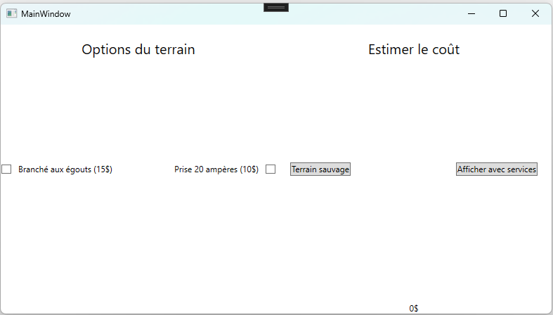

# Pratique d'examen

Cet examen est une pratique. Il est un peu trop long pour ce que je peux te demander de faire en 3 heures, mais il représente un très bon exemple d'exercice que tu devrais être en mesure de faire à ce stade-ci de la session.

Voici le lien sur lucid chart : https://lucid.app/lucidchart/76288256-8168-4823-b762-64296cbf8c24/edit?view_items=-V6emEyP8XIv&invitationId=inv_93e90f8b-571f-454f-b20e-1ef301b5ba46

## Objectif

- Être en mesure de comprendre comment un diagramme de classe représente des classes dans ton code.
- Être en mesure de créer une interface WPF.
  - Grid
  - Bouttons
  - TextBlock
  - Labels
  - Nouveaux éléments
- Appliquer le concept d'héritage.
  - abstract, override
  - base
- Appliquer le concept d'encapsulation.
  - public
  - private
  - protected
- Appliquer le concept d'abstraction.
- Faire du polymorphisme sans le savoir.

## Descrption de la demande.

Tu dois créer une interface simple qui permet de calculer le prix d'un terrain de camping. Dans notre camping, il y a deux types principaux de terrains.

De base, tous les terrains coûtent 30$.

1. Un terrain sauvage applique toujours le service qui est le plus cher. Le moins cher est gratuit.
2. Un terrain avec service applique toujours le plein prix de services s'ils sont choisis.
3. Il est possible de choisir ou non si on veut accéder au service.

Voici le coût de chacun des services.
1. Une borne d'électricité 20 ampères au coût de 10$
2. Une connexion aux égouts au coût de 15$

Tu dois être en mesure de produire l'interface suivante.

Comme tu peux voir, il y a une nouvelle balise que nous n'avons jamais utilisé nommée CheckBox. Il est possible d'accéder à son statut (Cochée ou pas) à l'aide de son attribut `IsChecked`.

Par exemple : `CheckBoxMonCheckBox.IsChecked.Value`.
Cet attribut est un bool.

## Voici les différentes étapes du projet

### La création de l'interface WPF.

Tu peux t'aider du lien sur lucid chart pour voir comment sont disposée les éléments.

### La création des classes

À l'aide de la deuxième page sur lucid chart, je t'invite à créer les classes en te basant sur le diagramme de classe.

### La programmation des méthodes

Voici quelques pistes pour t'aider à programmer ton travail. Lorsque tu cliques sur le bouton :

1. Tu crées deux objets services que tu mets dans un tableau.
2. Tu crées un objet terrain du bon type en passant en dans le constructeur les services. N'oublie pas l'utilisation de base:  `MonConstructeurDeMaClasseQuiHerite(Service[] services) : base(services)`

Lorsque tu cliques sur le bouton pour afficher le coût, tu dois changer la valeur du TextBlock en te basant sur le coût retourné par la méthode `CalculerCout`.
Cela va te permettre de créer un nouveau terrain avec de nouveaux services et d'ensuite calculer son coût. On va procéder de cette façon car je ne t'ai pas encore montré comment modifier les valeurs d'un objet dans un tableau.

Afin de t'aider dans ta gestion des objets, **tu dois créer un nouvel objet à chaque fois que tu cliques sur le bouton** de l'interface WPF.

Bonne programmation!